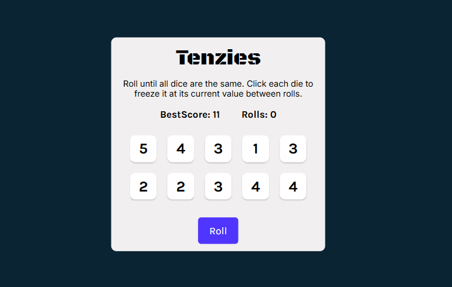

🎲 Tenzies Game

<div align="center">
<br>
 
</br>
</div>
Tenzies is a fun and interactive dice game built with React.js.
The goal is simple: roll until all dice show the same number. You can freeze dice by clicking on them to keep their value while rolling the rest. It’s a mix of luck and strategy!
<br>
<br>
🚀 Features
<br>
🎲 10 Dice Gameplay – Roll and hold dice interactively

🏆 Best Score Tracking – Stores your lowest roll count using LocalStorage

🔄 New Game Button – Reset and play again instantly

🎉 Confetti Animation – Celebrate when you win

📊 Roll Counter – See how many rolls it took to win

🎮 How to Play

Click Roll to roll all 10 dice.

Click on any die to hold its value (it stays fixed).

Continue rolling until all dice have the same number.

Try to win in the fewest rolls possible to beat your best score.

After winning, click New Game to restart.

🛠️ Tech Stack

React.js (Hooks & Components)

nanoid (for unique dice IDs)

React-Confetti (win animation)

LocalStorage (persistent best score)

📂 Project Setup

Clone the repo and install dependencies:

**Cloning the Repository**

```bash
git clone https://github.com/your-username/tenzies.git
cd tenzies
npm install
npm run dev
```

The app will run at http://localhost:3000
